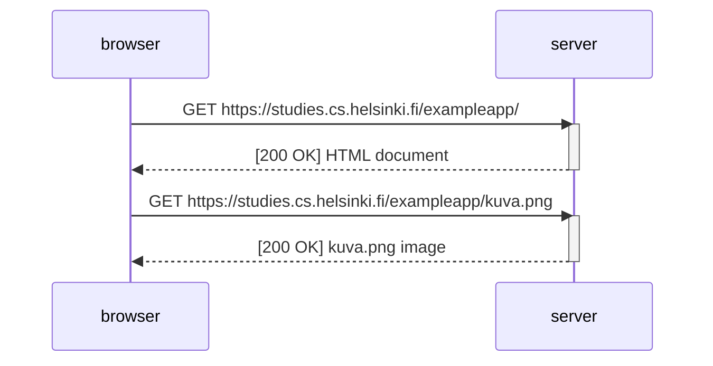
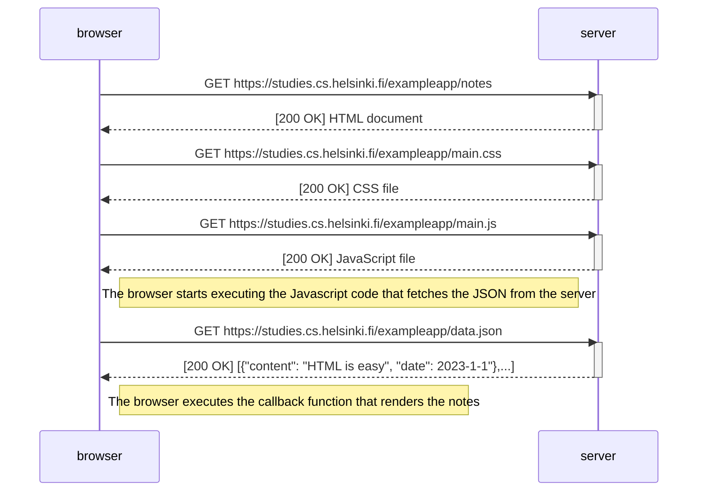
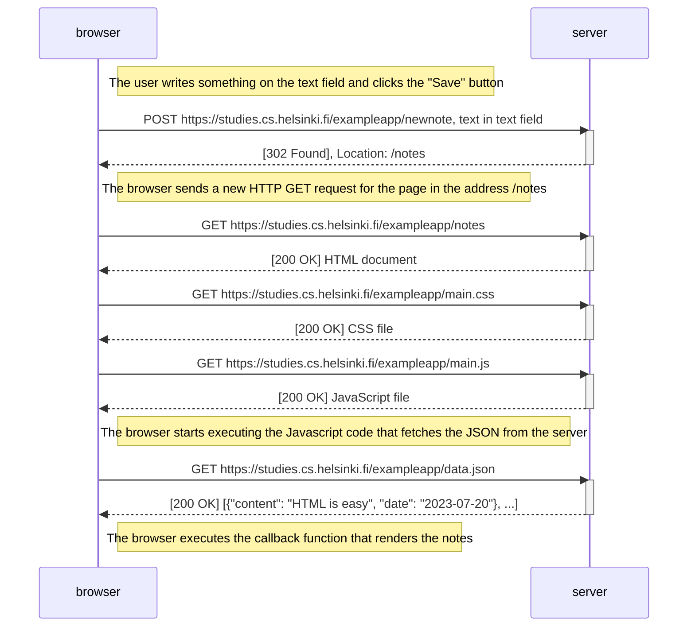
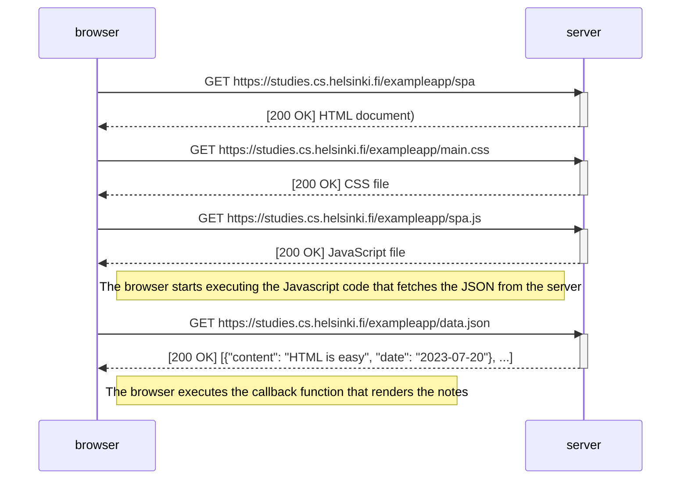
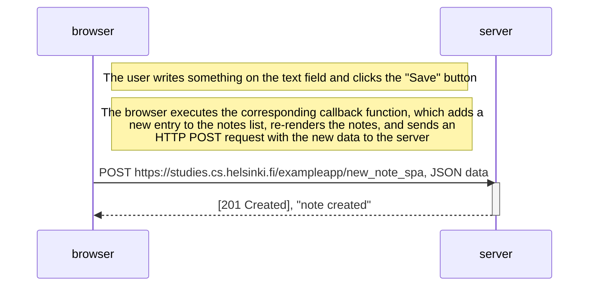

*From [Part 0 - b. Fundamentals of Web apps](https://fullstackopen.com/en/part0/fundamentals_of_web_apps).*

Example app: https://studies.cs.helsinki.fi/exampleapp/

## Simple HTML page

The server and the web browser communicate with each other using the HTTP protocol. The *Network* tab in the browser's Developer Console shows how the browser and the server communicate.

Open the example application: https://studies.cs.helsinki.fi/exampleapp/

When you reload the page, the *Network* tab will show that two events have happened:
* The browser has fetched the contents of the page studies.cs.helsinki.fi/exampleapp from the server
* And has downloaded the image kuva.png

The response of an HTTP GET request contains the key "Content-Type". When it's an HTML file, it tells us that the response is a text file and the contents are formatted with HTML. This way the browser knows the response to be a regular HTML page and will render it to the browser 'like a web page'.

```
Content-Type: text/html; charset=utf-8
```

In the HTML file there is a `` tag. Because of this tag, the browser does a second HTTP request to fetch the image *kuva.png* from the server. The response headers tell us that the "Content-Type" is *image/png*, so it is a png image. The browser uses this information to render the image correctly to the screen.

```
Content-Type: image/png
```

This is the sequence of events:



## Traditional webpage

Open the notes page of the example application: https://studies.cs.helsinki.fi/exampleapp/notes/

Here there are 4 requests:
* For the HTML page, which contains in its header a `<link>` tag referencing a CSS file, and a `<script>` tag referince a JavaScript file.
* For the CSS file.
* For the JavaScript file, which contains the lines `xhttp.open('GET', '/data.json', true); xttp.send()`.
* For the JSON file.
  


## Traditional webpage, submitting a form

When you type something on the form in the same *notes* page and click on *Save*, the browser will send an HTTP POST request to the address https://studies.cs.helsinki.fi/exampleapp/new_note. In return, there will be a HTTP status code 302, which is a URL redirect - it will ask the browser to get the page in the location */notes* (basically do a page refresh). After the page is refreshed, the new note is displayed with the rest of the notes.



## Single page app

Open the Single Page App version of the notes page: https://studies.cs.helsinki.fi/exampleapp/spa

SPA-style websites don't fetch all of their pages separately from the server like our sample application does, but instead comprise only one HTML page fetched from the server, the contents of which are manipulated with JavaScript that executes in the browser. The difference here is in the `<form>` of *spa.html*, the JavaScript file *spa.js* and the way a new note is added. The way the page is loaded is the same as the traditional webpages.



## Single page app, submitting data

The `<form>` in *spa.js* doesn't have an *action* or *method* attributes to define how and where to send the input data.

The POST request to the address */new_note_spa* contains the new note as JSON data containing both the content of the note (content) and the timestamp (date). The server will recognise that the data had the Content-Type "application/json" and is programmed to add that data to *data.json*. 

This is the JavaScript code running in the browser. The variable *notes* in the JavaScript code is updated with the new note before it is sent to the server. 

```javascript
var form = document.getElementById('notes_form')
form.onsubmit = function(e) {
  e.preventDefault()

  var note = {
    content: e.target.elements[0].value,
    date: new Date(),
  }

  notes.push(note)
  e.target.elements[0].value = ''
  redrawNotes()
  sendToServer(note)
}
```

The sequence of events is simply this:

