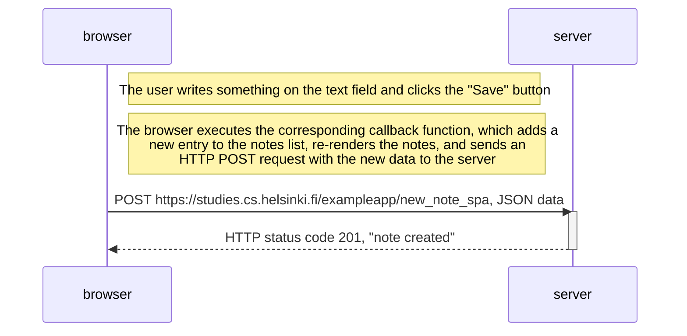

Sequence diagram depicting the scenario where the user creates a new note on the single-page app version of the notes app (https://studies.cs.helsinki.fi/exampleapp/spa).

```mermaid
sequenceDiagram
    participant browser
    participant server

    Note right of browser: The user writes something on the text field and clicks the "Save" button

    Note right of browser: The browser executes the corresponding callback function, which adds a <br>new entry to the notes list, re-renders the notes, and sends an <br> HTTP POST request with the new data to the server

    browser->>server: POST https://studies.cs.helsinki.fi/exampleapp/new_note_spa, JSON data
    activate server
    server-->>browser: HTTP status code 201, "note created"
    deactivate server

```